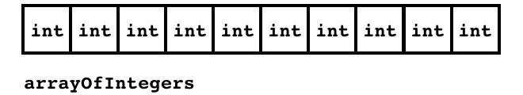
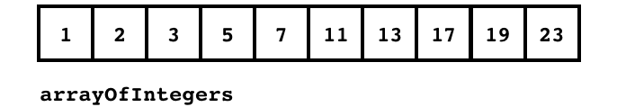
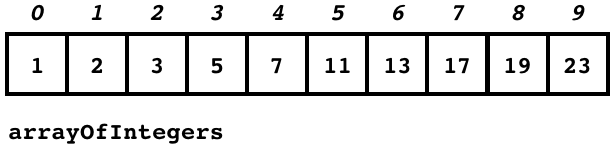
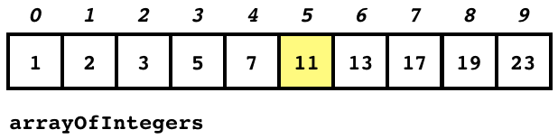

class: middle

# CART 253 | 06 | Arrays

---

# Today

## Exercise 03?
## Be the machine
## Object-Oriented Recap?
## Arrays

---

## Exercise 03?

- Vocabulary: _declare_, _initialise_, _instantiate_
- "Clicked" versus "clicked in"

---

# Declaring

_Declaring_ a variable is when we write the type and then the variable name. We're telling Processing "I want this variable to exist in my program."

```java
int myNewInteger;
```

---

# Initialising

_Initialising_ a variable is when we first put a value in it. Often part of the declaration, in `setup()`, or in a constructor.

```java
int myNewInteger = 10; // Declaring and initialising
```

```java
int myNewInteger; // Declaring

void setup() {
  myNewInteger = 10; // Initialising
}
```

```java
class Ball {
  int x; // Declaring a property (a variable that lives inside a class)
  int y; // Declaring another property

  Ball(int tempX, tempY) {
    x = tempX; // Initialising the property x
    y = tempY; // Initialising the property y
  }
}
```

---

# Instantiating

_Instantiating a class_ is when we create a `new` object in our program based on that class. It's like making the abstract class into a real thing.

```java
// Here are are DECLARING a new Ball variable
// INSTANTIATING the Ball class as a new object
// and INITIALISING the variable with the new object
Ball ball = new Ball(50,50);
```

---

# "Clicked" versus "Clicked in"

```java
Button button;

void setup() {
  button = new Button();
}

void draw() {
  button.display();
}

void mouseClicked() {
  button.mouseClicked();
}
```

---

# "Clicked" versus "Clicked in"

```java
class Button {
  int x;
  int y;
  int size;

  Button() {
    x = width/2;
    y = height/2;
    size = width/4;
  }

  void mouseClicked() {
    // Without this if statement, the Button would say it
    // was clicked whenever the user clicked ANYWHERE
    // With this if statement, the Button will say it is
    // clicked ONLY if the click was inside its circle
    if (dist(mouseX,mouseY,x,y) < size/2) {
      println("Button was clicked!");
    }
  }

  void display() {
    ellipse(x,y,size,size);
  }
}
```

---

class: middle

# Be the machine?

---

# Be the machine

- A really critical way to improve your programming is to spend time running through programs _as if you are the machine_
- That is, you start at the top of the main program and go down line by line
- You follow the flow of instructions, jumping to functions and methods, carrying arguments with you, and on and on
- You visualise what will appear on the screen and why

---

# Don't be the machine _too_ much

_He is more machine than man now, twisted and evil_  
\- Obi-Wan Kenobi

- It's a great to practice running through programs line by line
- But at some point you need to think in abstractions instead, so that you can cope with the complexity
- So instead of jumping "into" a function, for example, you take it for granted that it _works and does what it says_ without you going through it
- Instead of calculating the truth value of a condition for each possible scenario, you seek to understand what the condition _means_


---

class: middle

# Object-Oriented Recap

---

# Classes and Objects

- Remember that object-oriented programming involves these two kinds of things
- A _class_ is a _description_ of how some kind of thing works (like a Ball, a Paddle, a Bouncer, ...)
- An _object_ is a specific _instance_ of a class that exists in your program (the specific ball bouncing around, the left paddle, the right paddle, ...)

---

# Objects are good

- Compare the Exercise 01 code with the Exercise 03 code
- In Exercise 01 we have a single bouncing circle
- If we want another bouncing circle, we have to add a _lot_ of code
- In Exercise 03 we had _two_ bouncing circles _without_ lots of extra code
- Because we define the _idea_ of a Bouncer in the class, and then just _create_ multiple instances of that idea
- If we wanted to add a third Bouncer it would still be pretty easy...

---

# Again! Again?

- Want to review object-oriented programming?
- We can make a new class from scratch
- And base it on stuff we've seen a lot before so we can focus on the higher level stuff

---

# A "sphere"

```java
int x = width/2;
int y = height/2;
int size = width/2;

size(640, 480);

noStroke();
for (int i = size; i > 0; i-=5) {
  float c = map(i, 0, size, 200, 50);
  fill(c);
  ellipse(x, y, i, i);
}
```

- Here is a fun way to draw a "sphere" on the screen
- Let's make a class that can create these things
- And then improve the class to add things we think of...

---

class: middle

# Arrays

???

- The final piece of syntax! Amazing!
- After this there are no new special characters or anything to learn
- Also the last really fundamental concept in programming for us
- Also incredibly useful

---

# One ball, two balls, three balls, one hundred balls?

- Our Exercise 03 code lets us easily make new Bouncers by creating new ones in variables, and then updating and displaying them
- But if we wanted one hundred of them, it's going to get annoying...

```java
bouncer1 = new Bouncer(10,10,2,2,10,color(255,0,0,50),color(0,0,255,50));
bouncer2 = new Bouncer(20,10,2,2,10,color(255,0,0,50),color(0,0,255,50));
bouncer3 = new Bouncer(30,10,2,2,10,color(255,0,0,50),color(0,0,255,50));
bouncer4 = new Bouncer(40,10,2,2,10,color(255,0,0,50),color(0,0,255,50));
...
bouncer99 = new Bouncer(990,10,2,2,10,color(255,0,0,50),color(0,0,255,50));
bouncer100 = new Bouncer(1000,10,2,2,10,color(255,0,0,50),color(0,0,255,50));
```

---

# Worserer and worserer...

```java
void draw() {
  bouncer1.update();
  bouncer2.update();
  bouncer3.update();
  ...
  bouncer99.update();
  bouncer100.update();

  bouncer1.draw();
  bouncer2.draw();
  bouncer3.draw();
  ...
  bouncer99.draw();
  bouncer100.draw();
}
```

---

# We know the solution to this!

- What kind of thing can we use if we need to _repeat_ the same action of and over again in a program?
--

- A loop!
--

- So we want to be able to do something like...

```java
for (int i = 0; i < 100; i++) {
  bouncer_i = new Bouncer(10*i,10*i,2,2,10,color(255,0,0,50),color(0,0,255,50));
}
```
--

- Buuuuut, that doesn't work. Because there's no variable called `bouncer_i`

---

# We need something new...

- What we seem to need is a way to keep track of a a whole _set_ of similar things, instead of just one thing per variable
- Ideally we could have a variable that would store _all_ of our Bouncers in it for example
- And we could just refer to _which one we want_ when we're dealing with them
- And ideally we could use a _loop_ to go through all the elements in the set

---

# Arrays!

- Unsurprisingly, given today's topic, _arrays_ are the solution to this problem
- An array is basically _set of numbered boxes_ that you can store values in
- So a variable that is an array can store _multiple values_
- This is obviously mostly useful when all the values are _related to each other_

---

# An array of `int`s

```java
int[] arrayOfIntegers = new int[10];
```

- This is some of our new syntax
- It creates an _array that has spaces for 10 integers_
- Let's break it down...

---

# An array of `int`s

```java
int[] arrayOfIntegers = new int[10];
```

- First we have .codeHighlight[`int[]`]
- This is a _type_
- Just like we make a variable to store an integer with `int`
- Here we say `int[]` because it is an _array_ of `int`s
- The `[]` after the `int` is what tells Processing it's an array

---

# An array of `int`s

```java
int[] arrayOfIntegers = new int[10];
```

- Next we have .codeHighlight[`arrayOfIntegers`]
- This is the variable name, just like any variable name
- This is the variable that will _contain_ the array we're declaring

---

# An array of `int`s

```java
int[] arrayOfIntegers = new int[10];
```

- Now we have .codeHighlight[`=`]
- We're going to initialise our variable with a new array

---

# An array of `int`s

```java
int[] arrayOfIntegers = new int[10];
```

- Now we get .codeHighlight[`new`]
- With arrays we use `new` to tell Processing to make a _new_ array
- Makes some sense...

---

# An array of `int`s

```java
int[] arrayOfIntegers = new int[10];
```

- Finally we have .codeHighlight[`int[10]`]
- Here we're telling Processing what kind of array to create (to put into the variable)
- Again we see `int` because that's the _type_ of value the array will store in it
- Then we see `[10]` which tells Processing this array can store _ten_ `int`s inside it

---

# An array of `int`s

```java
int[] arrayOfIntegers = new int[10];
```

- Oh, and a .codeHighlight[`;`] of course!

---

# An array of `int`s

```java
int[] arrayOfIntegers = new int[10];
```

- So this line creates a new array with space for 10 integers in it, and puts that array into the variable called `arrayOfIntegers`
- We can imagine something like this:



---

# An array of actual numbers, though...

- We can also create a new array with numbers _already in it_ like this:

```java
int[] arrayOfIntegers = { 1, 2, 3, 5, 7, 11, 13, 17, 19, 23 };
```



- Notice how the _order_ of numbers we initialised the array with _matters_

---

# How do I get at them numbers?

```java
int[] arrayOfIntegers = { 1, 2, 3, 5, 7, 11, 13, 17, 19, 23 };
```

- It's great that we now have all these (prime) numbers stored in an array, but how can we do anything with them?
--

- Fortunately, the boxes in the array (called _elements_) are _numbered_ (from _zero_!)
- Those numbers are called _indexes_



---

```java
int[] arrayOfIntegers = { 1, 2, 3, 5, 7, 11, 13, 17, 19, 23 };
```


- So if I wanted to get to the _value_ `7` I would look at _element_...
--
 `4`
--

- And if I wanted to get to the _value_ `23` I would look at _element_...
--
 `9`
--

- And if I looked in _element_ `5` I would see the _value_...
--
 `11`
--

- And if I looked in _element_ `7` I would see the _value_...
--
 `17`

---

# In code now...

- We can refer to an element in an array using those square brackets again
- So if I want to refer to the _value_ at _index_ `5` I would write

```java
arrayOfIntegers[5]
```

- Which is which one?


---

# In code now...

- We can refer to element in an array using those square brackets again
- So if I want to refer to the _value_ at _index_ `5` I would write

```java
arrayOfIntegers[5]
```

- Which is which one? Right.



---

# Individual array elements are like variables

- We can use these references to array elements like any other variable
- So `arrayOfIntegers[5]` is just an `int` and we can use it like any `int`
- Which means we can use it in conditionals, or as an argument, or print it out...
- And we can also store an `int` in it, which might be the results of a calculation...

---

# Array elements are like variables

```java
int[] arrayOfIntegers = { 1, 2, 3, 5, 7, 11, 13, 17, 19, 23 };

println(arrayOfIntegers[5]);
```

---

# Array elements are like variables

```java
int[] arrayOfIntegers = { 1, 2, 3, 5, 7, 11, 13, 17, 19, 23 };

if (arrayOfIntegers[2] < arrayOfIntegers[3]) {
  println("Element at index 2 is less than element at index 3");
}
else {
  println("Element at index 2 is greater than element at index 3");
}
```

---

# Array elements are like variables

```java
int[] arrayOfIntegers = { 1, 2, 3, 5, 7, 11, 13, 17, 19, 23 };

arrayOfIntegers[2] = arrayOfIntegers[2] * arrayOfIntegers[4];

if (arrayOfIntegers[2] < arrayOfIntegers[3]) {
  println("Element at index 2 is less than element at index 3");
}
else {
  println("Element at index 2 is greater than element at index 3");
}
```

---

# Another way of setting the values of an array

- We could also set up the same `arrayOfIntegers` like this

```java
int[] arrayOfIntegers = new int[10];

arrayOfIntegers[0] = 1;
arrayOfIntegers[1] = 2;
arrayOfIntegers[2] = 3;
arrayOfIntegers[3] = 5;
arrayOfIntegers[4] = 7;
arrayOfIntegers[5] = 11;
arrayOfIntegers[6] = 13;
arrayOfIntegers[7] = 17;
arrayOfIntegers[8] = 19;
arrayOfIntegers[9] = 23;
```

- Maybe a bit less convenient in this case
- But we can (and will) imagine other scenarios...

---

# Arrays can store any kind of type in them!

```java
float[] arrayOfFloats = { 3.14159, 1.222222, 1.01 };

String[] lyrics = { "This", "is", "the", "song", "that", "doesn't", "end" };

color[] backgroundColors = { color(255,0,0), color(0,255,0), color(0,0,255) };

char controls = { 'w', 'a', 's', 'd' };
```

---

# Arrays can store objects in them!

```java
Bouncer[] bouncers = new Bouncer[3];

bouncers[0] = new Bouncer(10,10,2,2,10,color(255,0,0,50),color(0,0,255,50));
bouncers[1] = new Bouncer(20,20,2,2,10,color(255,0,0,50),color(0,0,255,50));
bouncers[2] = new Bouncer(30,30,2,2,10,color(255,0,0,50),color(0,0,255,50));
```
--

- Wait a minute!
--

- Now we can solve that problem of wanting to have 100 bouncers!!

---

# 100 Bouncers

```java
Bouncer[] bouncers = new Bouncer[100];

bouncers[0] = new Bouncer(10,10,2,2,10,color(255,0,0,50),color(0,0,255,50));
bouncers[1] = new Bouncer(20,20,2,2,10,color(255,0,0,50),color(0,0,255,50));
bouncers[2] = new Bouncer(30,30,2,2,10,color(255,0,0,50),color(0,0,255,50));
bouncers[3] = new Bouncer(40,30,2,2,10,color(255,0,0,50),color(0,0,255,50));
bouncers[4] = new Bouncer(50,30,2,2,10,color(255,0,0,50),color(0,0,255,50));
...
bouncers[98] = new Bouncer(990,30,2,2,10,color(255,0,0,50),color(0,0,255,50));
bouncers[99] = new Bouncer(1000,30,2,2,10,color(255,0,0,50),color(0,0,255,50));
```
--

- Oh no! This still sucks in the same way! What can we do?
--

- Oh yeah! The loop idea we had earlier!

---

# 100 Bouncers with a for loop

```java
Bouncer[] bouncers = new Bouncer[100];

for (int i = 0; i < 100; i++) {
  bouncers[i] = new Bouncer(10*i,10,2,2,10,color(255,0,0,50),color(0,0,255,50));
}
```

- OMG that's good. Right?

---

# 100 Bouncers with a for loop and using the `length` property

```java
Bouncer[] bouncers = new Bouncer[100];

for (int i = 0; i < bouncers.length; i++) {
  bouncers[i] = new Bouncer(10*i,10,2,2,10,color(255,0,0,50),color(0,0,255,50));
}
```

- `bouncers.length` gives us the length/size of the array (100 in this case)
- You can use this for any array
- This is a _totally classic_ loop with an array
- You will do this so many times in your life
- And you will think of me

---

# 100 Bouncers bouncing

- We can use this `for`-loop through an array trick everywhere

```java
void draw() {
  for (int i = 0; i < bouncers.length; i++) {
    bouncers[i].update();
    bouncers[i].display();
  }
}
```

- Tell me you're not impressed. I dare you.

---

# Multiball action?!

- Let's edit the Pong base code to have 100 balls!?

---

# Cycling through an array

- One nice trick to know with an array is being able to cycle through it
- And then wrap back around when you hit the end
- For example...

---

# The Song that Doesn't End (Array Mix)

```java
String[] messages = {
  "This is the song that doesn't end",
  "Yes it goes on and on my friend",
  "Some people started singing it,\nnot knowing what it was",
  "And they'll continue singing it forever,\njust because:"
};
int messageIndex = 0;

void setup() {
  size(640,480);
  textSize(24);
  textAlign(CENTER,CENTER);
  fill(255);
  frameRate(1);
}

void draw() {
  background(0);
  text(messages[messageIndex],width/2,height/2);
  messageIndex++;
  if (messageIndex >= messages.length) {
    messageIndex = 0;
  }
}
```

---

# The Song that Doesn't End (Modulo Mix)

```java
String[] messages = {
  "This is the song that doesn't end",
  "Yes it goes on and on my friend",
  "Some people started singing it,\nnot knowing what it was",
  "And they'll continue singing it forever,\njust because:"
};
int messageIndex = 0;

void setup() {
  size(640,480);
  textSize(24);
  textAlign(CENTER,CENTER);
  fill(255);
  frameRate(1);
}

void draw() {
  background(0);
  text(messages[messageIndex],width/2,height/2);
  messageIndex = (messageIndex + 1) % messages.length;
}
```

---

# For the curious: `ArrayList`

- I'll talk about these next week
- But for now just note that there is another kind of array-like thing called an `ArrayList`
- And it's a bit more flexible than a standard array, which can be nice
- It's helpful because it can _sort_ its set of objects, and you can more easily add and remove elements from it (including changing its size dynamically)
- Though you can get on perfectly well without it too

---

# Hi, my name is `null`

- Before we finish up here, a word about `null`
- If I make a variable like this

```java
Bouncer myBouncer;
```

- What is inside `myBouncer` right now?
--

- The answer is `null`
- Which is the "nothingness" that exists when a variable that holds an object has nothing in it

---

# Getting along with your new friend `null`

- `null` is a bit of a pain
- If you accidentally try to use a variable with null in it like this

```java
Bouncer myBouncer;
myBouncer.update();
myBouncer.display();
```

- You'll get the most famous error message in the world:

__NullPointerException__

---

# Oh, `null`, you little devil

- A __NullPointerException__ crashes your program
- But Processing highlights where it happened
- And it means that whatever variable on that line that you thought had an object in it _doesn't_, it's `null`
- So you probably forgot to initialise the variable with a value

_Don't forget to make sure that your object variables have something in them before you use them_

---

# Homework/Nowwork

- __Now:__ Work on the [Midterm Project](https://github.com/pippinbarr/cart253-2017/wiki/Midterm-Project)
- __Nowish:__ Work on [Exercise 04](https://github.com/pippinbarr/cart253-2017/wiki/Exercise-04), due next week after class (I've tried to keep it simpler than usual so it doesn't compete with finishing the midterm!)
- The readings for _next week_ are Chapters 13 and 14 of _Learning Processing_ (Mathematics and Translation and Rotation)
- The reading for _this week_ is Chapter 9 of _Learning Processing_ (Arrays)
