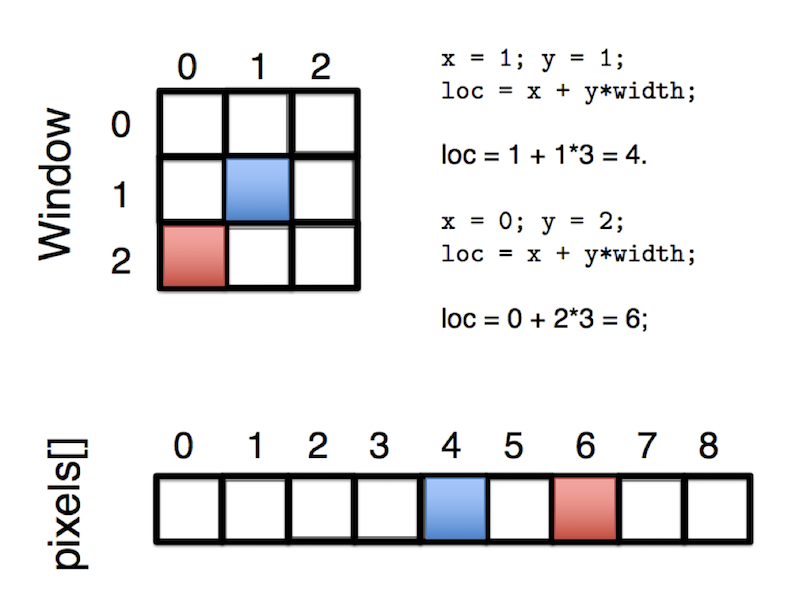

class: middle

# CART 253 | 08 | Images

---

# Today

## Exercise 04?
## Images
## Concept and technical pitch

---

# Exercise 04?

---

# That double for-loop... and that (i==j)...

```java
for (int i = 0; i < griddies.length; i++) {
  griddies[i].update();
  for (int j = 0; j < griddies.length; j++) {
    if (i == j) {
      continue;
    }
    griddies[i].collide(griddies[j]);
  }
  griddies[i].display();
}
```

---

# That move code...

```java
int xMoveType = floor(random(-1,2));
int yMoveType = floor(random(-1,2));

x += size * xMoveType;
y += size * yMoveType;
```

---

# Just for fun, another kind of movement

See [Example of Movement with Speed and Rotation](https://github.com/pippinbarr/cart253-2017/tree/master/examples/movement_with_speed_and_rotation) in the `examples/` folder of the class Code repository

---

class: middle

# Images

---

# PImage

- We already know the basics of using images in Processing
- We know that we can load them into a variable (either from a file in our `data` folder or a URL)
- And we know that we can display them on the screen like a fancy rectangle

```java
PImage catImage;

void setup() {
  size(640,480);
  catImage = loadImage("https://iheartcats.com/wp-content/uploads/2016/08/28858986841_e563192682_z.jpg");
}

void draw() {
  image(catImage,0,0);
}
```

---

# `imageMode()`

- Images have `imageMode()` for changing how they're drawn
- `imageMode(CENTER);` means the image will be drawn from its center
- `imageMode(CORNER);` means the image will be drawn from its top-left corner

---

# My New Career as a Wedding Videographer

```java
float theta = 0;
float scaleFactor = 1;
float scaleDirection = 1;
PImage catImage;

void setup() {
  size(640, 480, P3D);
  catImage = loadImage("https://iheartcats.com/wp-content/uploads/2016/08/28858986841_e563192682_z.jpg");
}

void draw() {
  translate(width/2, height/2);
  rotateZ(theta);
  rotateY(theta);
  scale(scaleFactor);
  imageMode(CENTER);
  image(catImage, 0, 0);
  theta += 0.1;
  scaleFactor += (0.01 * scaleDirection);
  if (scaleFactor < 0 || scaleFactor > 2) {
    scaleDirection = -scaleDirection;
  }
}
```

???

- All the transformation functions work on images as well

---

# `tint()`

- There's even a sort of "`fill()`" for images called `tint()`

```java
PImage catImage;
color tintColor = color(random(255),random(255),random(255));

void setup() {
  size(640, 480, P3D);
  catImage = loadImage("https://iheartcats.com/wp-content/uploads/2016/08/28858986841_e563192682_z.jpg");
}

void draw() {
  tint(tintColor);
  image(catImage, 0, 0);
}

void mouseClicked() {
  tintColor = color(random(255),random(255),random(255));
}
```

---

# Okay...

- So far this is not necessarily super mind-blowing?
- Images are pretty much just a picture pasted as a rectangle on the screen
- There's nothing all that dynamic we're doing with them yet
- Beyond messing with the rectangle itself
- So...

---

# Images are just a bunch of pixels


???

- Zoom in enough and it's a bunch of coloured squares

---

# Images are just a _grid_ of pixels

- Every pixel in an image has an `x` and `y` coordinate in that image, and a `color`
- In fact a single pixel can just be thought of as a `color` at a specific `x,y` position
- The top left pixel is at `0,0`, the next one to the right is at `1,0` and so on
- We already know about that basic idea from drawing shapes in our window
- Because a _window_ is just a grid of pixels

---

# `PImage`s are just an _array_ of pixels

- A `PImage` in Processing is represented with an array
- The array contains a colour for each pixel in the image
- The weird thing about the array is that it is _one dimensional_
- Just one long sequences of boxes, even though an image is 2D

---

# `.pixels[]`

- We can get access to a `PImage`'s pixels by asking for its `pixels` array
- This `pixels` array is _built into `PImage`_ so it's there automatically

```java
PImage myImage;

void setup() {
  size(319,319);
  myImage = loadImage("https://www.beatsbydre.com/content/dam/beats/content-blocks/pdp/color-selector/(PRODUCT)RED.jpg");
}

void draw() {
  image(myImage,0,0);
  // Get pixel 100
  color pixelOneHundred = myImage.pixels[100];
  // Print the value of pixel 100
  println("Color as integer:" + pixelOneHundred);
  // Print it out in hex
  println("Color as hex:" + hex(pixelOneHundred));
}
```

---

# Changing `pixels`

- More importantly, we can _change_ the values of pixels to manipulate what an image looks like!
- But to do that we need to _tell_ the image we're going to do that
- So first we use `myImage.loadPixels();` which means "I'm going to change your pixels soon"
- Then we change the values in the pixels array to change the image
- Then we use `myImage.updatePixels();` to actually make our changes take effect

---

# Just one tiny little pixel...

```java
PImage myImage;

void setup() {
  size(632,475);
  myImage = loadImage("http://buildingontheword.org/wp-content/uploads/2016/08/cat.jpg");
}

void draw() {
  myImage.loadPixels(); // Get ready!
  myImage.pixels[0] = color(255,0,0); // Edit!
  myImage.updatePixels(); // Change!
  image(myImage,0,0);
}
```

---

# Every damn pixel!

- Let's randomly change pixels in the image...

```java
PImage myImage;

void setup() {
  size(632,475);
  myImage = loadImage("http://buildingontheword.org/wp-content/uploads/2016/08/cat.jpg");
}

void draw() {
  myImage.loadPixels(); // Get ready!
  for (int i = 0; i < myImage.pixels.length; i++) {
   myImage.pixels[i] += random(-800,800);
  }
  myImage.updatePixels(); // Change!
  image(myImage,0,0);
}
```

---

# Every damn pixel again!

- You can get some kind of amazing effects by messing around...

```java
PImage myImage;

void setup()  {
  size(632,475);
  myImage = loadImage("http://buildingontheword.org/wp-content/uploads/2016/08/cat.jpg");
}

void draw()  {
  myImage.loadPixels();
  for (int i = 0; i < myImage.pixels.length-1; i++)  {
    myImage.pixels[i] = myImage.pixels[i] + myImage.pixels[i+1]/10000;
  }
  myImage.updatePixels();
  image(myImage,0,0);
}
```

---

# The Window's `pixels`

- Our actual program is basically just a series of images displayed in the window
- And the window actually has its own `pixels` array representing all of its pixels
- Which we can also get access to and change at will
- It's just called `pixels[]` because it's the main pixels array
- So we also just call `loadPixels()` and `updatePixels()` too, no image name needed

---

```java
void setup() {
  size(500, 500);
}

void draw() {
  loadPixels();
  for (int i = 0; i < pixels.length; i++) {
    pixels[i] = color(random(0, 255));
  }
  updatePixels();

  //for (int x = 0; x < width; x++) {
  //  for (int y = 0; y < height; y++) {
  //    stroke(random(255));
  //    point(x,y);
  //  }
  //}
}
```

- Notice how much more efficient that is than using `point()` or `rect()`?

---

# Problem: We usually think of an image as 2D

- Currently we're dealing with this one-dimensional `pixels` array by just doing "something" to every pixel
- But if we wanted to talk about specific coordinates in the image we're currently in trouble
- We only have a 1D reference point into the image, so we need a trick...

--

`int loc = x + y * width;`
--

- This calculates a location in the 1D array of pixels based on an `x` and `y` coordinate along with the `width` of the image (or window)

---



---

# Image Processing

- Now that we know how to convert from coordinates to a specific pixel in the `pixels` array we can:

0. Load an image
1. Load its pixels with `loadPixels()`
2. Go through every pixel based on its `x` and `y` coordinates
3. Either _change it_ in an interesting way or _use its information_ in an interesting way
4. Update the pixels with `updatePixels()` (if we changed them)

- Image processing for fun and profit!

---

# An image processing loop

```java
myImage.loadPixels();
loadPixels();
for (int x = 0; x < myImage.width; x++) {
  for (int y = 0; y < myImage.height; y++) {
	 int loc = x + y * myImage.width;
    // Do something cool with myImage.pixels[loc]
    // Either change it or use the information it represents
    // (A colour, obviously, but colours mean things!)
  }
}
updatePixels(); // If we changed the pixels array we need to update it
```

(Full code for doing this in Presenter Notes, press 'P')

???

```java
PImage myImage;

void setup() {
  size(632,475);
  myImage = loadImage("http://buildingontheword.org/wp-content/uploads/2016/08/cat.jpg");
}

void draw() {
  myImage.loadPixels();
  for (int x = 0; x < myImage.width; x++) {
    for (int y = 0; y < myImage.height; y++) {
  	 int loc = x + y * myImage.width;
      // Do something cool with the information in myImage.pixels[loc]
      // Either use it change it or use the information it represents
      // (A colour, obviously, but colours mean things!)
    }
  }
  myImage.updatePixels(); // If we changed the pixels array we need to update it
  image(myImage,0,0)
}
```

---

# Interactive pixels...

```java
int loc = x + y*width;
float r = red(myImage.pixels[loc]);
float g = green(myImage.pixels[loc]);
float b = blue(myImage.pixels[loc]);

if (mouseX < width/2) {
  r++;
} else {
  b++;
}
if (mouseY < height/2) {
  g++;
} else {
  r--;
}      
myImage.pixels[loc] = color(r, g, b);
```

- `red()`, `green()` and `blue()` give you individual RGB values
- Notice how the image _loses information_ over time because we're changing it!

---

# `createImage()`

- Sometimes you might not want to corrupt the original image
- Luckily you can create a _new_ image and use _that_ to display your whacky tranformations
- We use `createImage(width,height,RGB)` to create a new, blank image that uses RGB information
- So...

---

```java
PImage source;
PImage dest;

void setup() {
  source = loadImage(“myNiceImage.png”);
  dest = createImage(source.width,source.height,RGB);
}
```

- Now we can _look at_ the `pixels` in `source` but _change_ the pixels in `dest` based on them
- Note that we have to `loadPixels()` and `updatePixels()` for `dest` if we're going to change them
- Example in Presenter Notes (press 'P')

???

```java
PImage source;
PImage dest;

void setup() {
  size(632, 475);
  source = loadImage("http://buildingontheword.org/wp-content/uploads/2016/08/cat.jpg");
  dest = createImage(source.width,source.height,RGB);
}

void draw() {
  dest.loadPixels();
  for (int x = 0; x < source.width; x++) {
    for (int y = 0; y < source.height; y++) {

      int loc = x + y*width;

      float r = red(source.pixels[loc]);
      float g = green(source.pixels[loc]);
      float b = blue(source.pixels[loc]);

      r += dist(mouseX,mouseY,width/2,height/2);
      g += dist(mouseX,mouseY,0,0);
      b += dist(mouseX,mouseY,width,height);

      dest.pixels[loc] = color(r, g, b);
    }
  }
  dest.updatePixels(); // If we changed the pixels array we need to update it
  image(dest,0,0);
}
```

---

# Corruption without corruption

```java
PImage source;
PImage dest;

void setup() {
  size(632, 475);
  source = loadImage("http://buildingontheword.org/wp-content/uploads/2016/08/cat.jpg");
  dest = createImage(source.width,source.height,RGB);
}

void draw() {
  dest.loadPixels();
  for (int x = 0; x < source.width; x++) {
    for (int y = 0; y < source.height; y++) {

      int loc = x + y*width;

      if (loc < dest.pixels.length - 1) {
        dest.pixels[loc] = source.pixels[loc] + source.pixels[loc + 1];
      }
    }
  }
  dest.updatePixels(); // If we changed the pixels array we need to update it
  image(dest,0,0);
}
```

---

# Adjacent pixels tend to be related

- Unless you have a completely random image, adjacent pixels are related
- Because images are usually of some kind of space
- And nearby pixels are therefore representing things that are nearby (or at least related) in space
- We can tune our processing of images toward that idea of relationships between pixels

---

# Edge detection

```java
for ( int x = 1; x < source.width; x++ ) {
  for ( int y = 0; y < source.height; y++ ) {
    float threshold = 10;
    int loc = x + y * source.width;
    color pixel = source.pixels[loc];
    int leftLoc = (x - 1) + y * source.width;
    color leftPixel = source.pixels[leftLoc];
    float diff = abs(brightness(pixel) -  brightness(leftPixel));
    if ( diff > threshold ) {
      dest.pixels[loc] = color(255);
    } else {
      dest.pixels[loc] = color(0);
    }
  }
}
```

- `brightness(color)` gives a brightness value for that colour!
- `abs(number)` gives you the _absolute value_ of that number
- Why am I starting `x` at `1` instead of `0`?

???

- Note how this is only possible because we have coordinates in 2D instead of a 1D array

---

# Convolution matrices

- The book has some great material on the idea of _convolution matrices_
- These are much more sophisticated ways of doing special kinds of image processing
- Like sharpening, blurring, edge detection, etc.
- In fact, I believe this is how many image-processing software filters (like those in Photoshop) work
- However, it's complex, and there's no need to boggle ourselves too much more?
- See section 15.9 if you want to know more

---

# Video!

- As we all know, video is just a sequence of different images played in sequence
- So all of these ideas about image processing can also be applied to video
- And in particular they can be applied to _webcam_ input!
- Let's find out how to do that...

---

# Libraries

- In programming, it would be a huge pain if we always had to write everything from the ground up
- There are lots of tasks that _lots_ of people want to be able to do
- So it would be great if they were solved _once_ and then _shared_
--

- That's what _libraries_ are
- A library is a set of code that provides you with code so you don't have to write it
- Like a game engine, or an artificial intelligence algorithm, or 2D physics
- Or using the webcam!

---

# The video library

- There is a library available for Processing that allows us to work with video and the webcam
- It's called "video", which is pretty sensible
- A library is just a set of files that define the code that library provides for us
- So the video library provides a bunch of code for dealing with video and webcams
- Because who wants to write that themselves, after all?
- Nobody!
--
 Except the person who wrote the video library!

---

# Installing the video library

- In Processing if we go to `Sketch > Import Library...` and we can see Video listed, then we know the library is already installed
- If _not_, we go to `Sketch > Import Library... > Add Library...` to bring up Processing's interface for downloading libraries
- From there we can scroll or search for "Video" and click `Install`
--

- You may have noticed there are a bunch of other libraries listed!
- You could use those!

---

# Using libraries in general

1. _Install_ it as we did with the video library
2. Find its _documentation_ online either with a search like "processing video library" _or_ by going to the [Processing Reference's Libraries section](http://www.processing.org/references/libraries) and looking for it there
3. _Read the introduction_ to the documentation so you understand what the library is for
4. Click on a _method or object_ you're interested in and read about that
5. Copy some _example code_ and run it in Processing
6. Start coming up with your own ideas

---

# `import`ing the video library

- To tell Processing we want to use a library, we have to `import` it at the top of our program
- In the case of the video library, we need to write

```java
import processing.video.*;
```

- _Or_ we can go up to `Sketch > Import Library...` and select "Video" from the list (now that we have installed it)
- That will write the appropriate `import` at the _top_ of our code (we always `import` at the top of the main program)

---

# The `Capture` object

- To access the information the video library makes available we use a `Capture` object
- This is a common way that we use libraries - they provide a specific `class` that we can make an object from to access the library's abilities
- Because a `class` is a great way to keep a whole lot of methods and properties together safely
- So we need to declare a `Capture` variable like this

```java
Capture video;
```

---

# Making a new `Capture` object

- To actually put an object into our variable, we need to make a `new` one like this in `setup()`

```java
video = new Capture(this,640,480,30);
```

- `this` is a bit mysterious but refers to the _this program_ (the `Capture` object wants to know about it)
- `640` and `480` are the dimensions we want to capture from the webcam
- `30` is the framerate to capture at

---

# Starting the webcam

- To actually tell the webcam to turn on and start capturing video we need to write

```java
video.start();
```

- We don't _have_ to do that in `setup()`, we could trigger it elsewhere
- But for now I'll be doing it in `setup()`

---

# Once again

- So to get set up with the webcam we need:

```java
import processing.video.*;

Capture video;

void setup() {
  video = new Capture(this,640,480,30);
  video.start();
}
```
- And indeed if we run this, the webcam light should turn on
- (If it doesn't, we have problems, which is sad.)

---

# Size matters

- The size that you choose for the video feed is important.
- For one thing, you probably want it to match the aspect ratio of your webcam, or things will look odd.
- For another thing, the bigger you make it, the slower your program will be, because it will be processing more pixels.
- Not to mention that when we process video, we're processing it every frame, so the numbers add up!

---

# Size matters

- If we capture at 640x480 that is 307,200 pixels in each frame of video
- If we're capturing at 30 frames per second that is 9,216,000 pixels per second
- That is a lot of pixels, mon frère
- If you're _processing_ every single pixel, every single frame, you're performing almost 10 million of those calculations per second
- So don't be surprised if things slow down a bit potentially
--

- Although, you know, technology is amazing and keeps getting faster

---

# Getting the video frames!

- In order to actually access a frame of video we need to ask for it in our `draw()` like this

```java
if (video.available()) {
  video.read();
}
```

- This will read in a frame of data (as an image) if there's one available
- The frame is just a `PImage`

---

# Webcam chat with yourself

```java
import processing.video.*;

Capture video;

void setup() {
  size(640,480);
  video = new Capture(this,640,480,30);
  video.start();
}

void draw() {
  if (video.available()) {
    video.read();
  }
  image(video,0,0);
}
```

---

# Video processing

- If each frame of video data is "just" a `PImage`...
- Then we can do all the same image processing stuff we were doing before
- Except better because it's video...

---

# Video edge detection!

- We can use our edge detection code on the current video frame
- And output the results to the window's `pixels` array!

```java
loadPixels();
for ( int x = 1; x < video.width; x++ ) {
  for ( int y = 0; y < video.height; y++ ) {
    float threshold = 10;
    int loc = x + y*video.width;
    color pix = video.pixels[loc];
    int leftLoc = (x-1) + y*video.width;
    color leftPix = video.pixels[leftLoc];
    float diff = abs(brightness(pix) -  brightness(leftPix));
    if ( diff > threshold ) {
      pixels[loc] = color(255);
    } else {
      pixels[loc] = color(0);
    }
  }  
}
updatePixels(); // If we changed the pixels array we need to update it
```

---

# Video colour tracking!

```java
int reddestX = 0;
int reddestY = 0;
float record = 1000;

for ( int x = 1; x < video.width; x++ ) {
  for ( int y = 0; y < video.height; y++ ) {
    int loc = x + y * width;
    color pixelColor = video.pixels[loc];
    float amount = dist(255,0,0,red(pixelColor),green(pixelColor),blue(pixelColor));
    if (amount < record) {
      record = amount;
      reddestX = x;
      reddestY = y;
    }
  }
}

fill(255,0,0);
image(video,0,0);
ellipse(reddestX,reddestY,10,10);
```

---

# In the end...

- It all comes down to what you can imagine doing with the information a webcam (or image) provides!
- Just remember that the colours of pixels in a single frame are giving you _information_ (about the space represented, about the quality of light, about what objects are present, ...)
- And the _sequence_ of frames are giving you _information_ as well (time passing, the movement of objects, the changing light, ...)
- At one point I made a platformer using the webcam that would allow you to "stand" on a specific colour of pixel - you could create levels in the real world by holding, say, red objects in front of the camera
- It was cool. Doesn't work anymore. _You_ make something.

---

# Homework/Nowwork

- __Now:__ Finish [Exercise 05](https://github.com/pippinbarr/cart253-2017/wiki/Exercise-05)
- __Also now:__ Pippin will be coming around to hear your concept and technical pitch for the [Final Project](https://github.com/pippinbarr/cart253-2017/wiki/Final-Project)
- __Nowish:__ Start [Exercise 06](https://github.com/pippinbarr/cart253-2017/wiki/Exercise-06), due next week
- The readings for _next week_ are Chapters 20 and 21 of _Learning Processing_ (Sound and Exporting)
- The readings for _this week_ were Chapters 12 and 15 of _Learning Processing_ (Libraries and Images)
